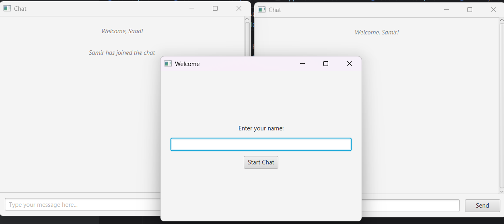
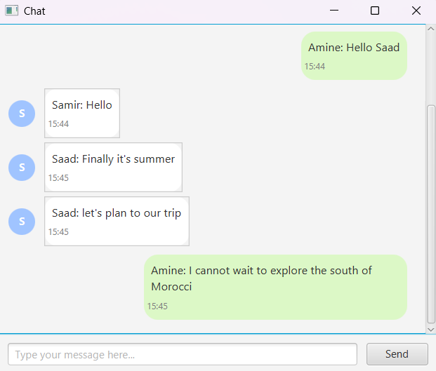

# JavaFX Multi-Client Chat Application

This is a JavaFX-based multi-client chat application built using sockets and multithreading. It simulates a real-time messaging platform where multiple users can connect, exchange messages, and receive system notifications.

## Features

- Graphical user interface using JavaFX
- Real-time communication using socket programming
- Multi-client support with server-side broadcasting
- Custom styled chat bubbles for sender/receiver messages
- Welcome screen with username input
- System messages for user join/leave
- Timestamp for every message
- Profile initials as message avatars

## Application Overview

### Welcome Window



- Each client is prompted to enter their name.
- Once submitted, they join the group chat.

### Chat Interface




- Messages are shown with sender name, profile initial, and timestamp.
- Own messages are aligned right in green.
- System notifications appear centered.

## Technologies Used

- Java 23 (JDK 17+ module path for JavaFX)
- JavaFX for GUI
- TCP Sockets for networking
- Multithreading for handling multiple clients

## Project Structure

```
POO_BDCC/
└── Application-Chat/
    ├── Chat.java
    ├── Client.java
    ├── Server.java
    ├── ServerMultiThread.java
    ├── SocketThread.java
    └── README.md
```

## Run Instructions

1. Start the `ServerMultiThread` class to run the server.
2. Run the `Chat` class in multiple instances to simulate multiple clients.
3. Enter a unique username in each window to join.

## Author

Saad EL MABROUK

---