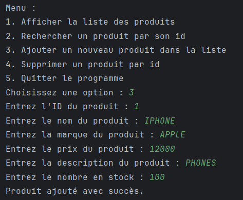
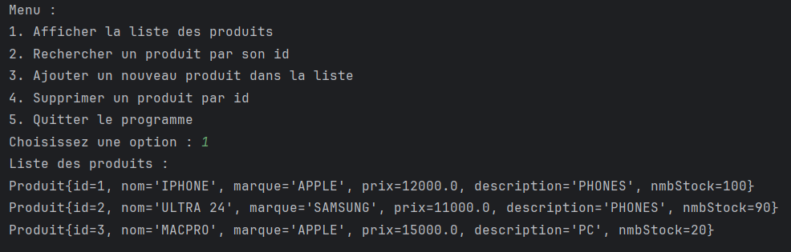
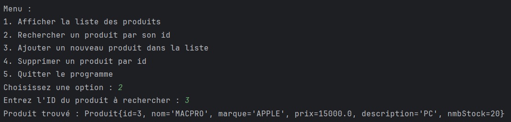
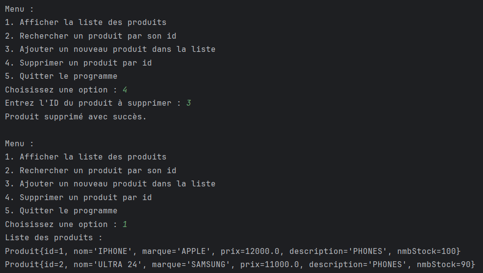

# 🧪 TP1 – Java POO & Generic Collections

This project is a command-line based **Product Management System** developed as part of the BDCC coursework at ENSET. The goal was to **practice generics and interfaces** in Java using a product CRUD app.

---

## 📚 Exercise Description

**Objective**: Use generic programming (`generics`) with a collection of `Produit` objects.

### 📝 Requirements:
1. Create a `Produit` class with:
    - `id`, `nom`, `marque`, `prix`, `description`, `nmbStock`

2. Create a **generic interface** `IMetier<T>` with:
    - `add(T o)`: add an object
    - `getAll()`: return list of all objects
    - `findById(long id)`: find object by id
    - `delete(long id)`: delete object by id

3. Implement this interface in `MetierProduitImpl` using a list of `Produit`.

4. Create a menu-driven console app in `Application` class to:
   ```
    - Display all products
    - Search product by ID
    - Add a new product
    - Delete a product by ID
    - Exit the application

   ```

---

## 🧠 Concepts Practiced

- Java Generics
- Interface implementation
- Collections (ArrayList)
- Object-oriented programming (encapsulation, separation of concerns)
- Console I/O

---

## 💻 How to Run

1. Clone the repo or copy files inside `TP1/`
2. Compile all files:
```bash
javac src/*.java
```
3. Run the app:
```bash
java src/Application
```

---

## 📸 Screenshots

### ➕ Adding Products


### 📦 Displaying Products


### 🔍 Search by ID


### ❌ Delete Product


---

## 🗂️ Project Structure

```
TP1/
├── src/
│   ├── Application.java
│   ├── IMetier.java
│   ├── MetierProduitImpl.java
│   └── Produit.java
├── images/
│   ├── 1.png ... 5.png
└── README.md
```

---

## 👤 Author

Saad EL MABROUK