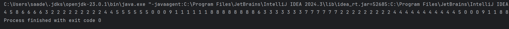
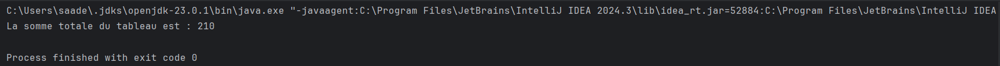

# TP3: Multi-threading in Java

This project demonstrates two exercises focused on Java multithreading: 
1. Displaying values concurrently using multiple threads.
2. Calculating the sum of an integer array using a thread pool for parallel computation.

---

## Exercise 1: Concurrent Display Using Threads

This part demonstrates how multiple threads can run simultaneously and produce outputs in an unordered manner.

### Description

- A class `Talkative` implements `Runnable`.
- It accepts an integer `id` in its constructor.
- The `run()` method prints this ID 100 times.
- In the `main()` method, we create 10 `Thread` instances, each with a unique `Talkative` object.
- Each thread is started, allowing them to run concurrently.

### Code Structure

- `Talkative.java`: Contains the definition of the `Runnable` implementation.
- `Main.java`: Launches multiple threads.

### Observations

- Output values are unordered due to thread interleaving.
- Some threads may complete faster than others.

### Screenshot



---

## Exercise 2: Parallel Array Sum Using Thread Pool

This part showcases how to distribute computational work across multiple threads to improve performance.

### Description

- A class `Sommeur` implements `Runnable`.
- The constructor accepts an integer array and two indices to define the range of computation.
- A method `getSomme()` returns the computed partial sum.
- The `Main` class initializes an integer array, splits it into chunks, and assigns them to different threads.
- After all threads complete execution, the partial sums are combined to compute the final result.

### Code Structure

- `Sommeur.java`: Implements logic to sum a portion of an array.
- `Main.java`: Manages thread pool, distributes work, and aggregates results.

### Screenshot



---

## Requirements

- Java 17+
- JDK with multithreading support
- IDE like IntelliJ IDEA or VSCode

---

## How to Run

1. Compile all `.java` files.
2. Run the `Main` class from your IDE or using the terminal.

```bash
javac *.java
java Main
```

---

## 👤 Author

Saad EL MABROUK
