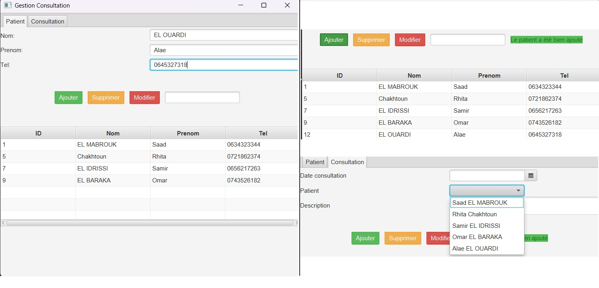
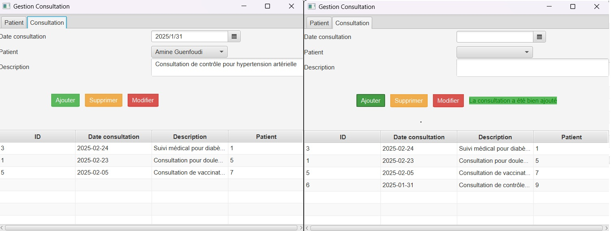
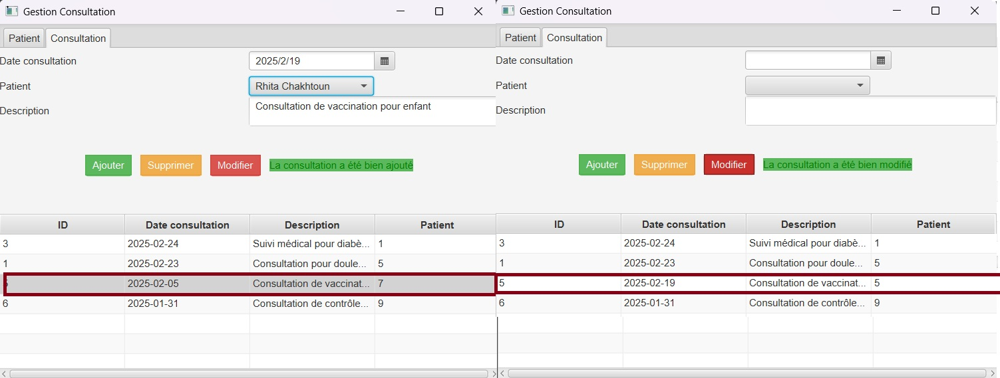
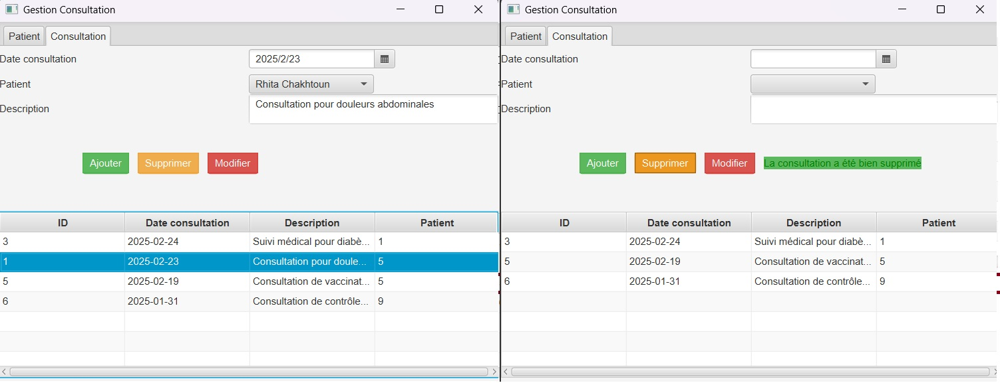

Interface des patients et consultations:

Ajouter un patient actualise le tableau des patients ainsi que le combobox des consultations en récupérant les données mises à jour via cabinetService.

Modifier un patient actualise le tableau des patients ainsi que le combobox des consultations en récupérant les données mises à jour via cabinetService.

Supprimer un patient actualise le tableau des patients ainsi que le combobox des consultations en récupérant les données mises à jour via cabinetService.

Ajouter une consultation.

Modifier une consultation

Supprimer Une consultation

